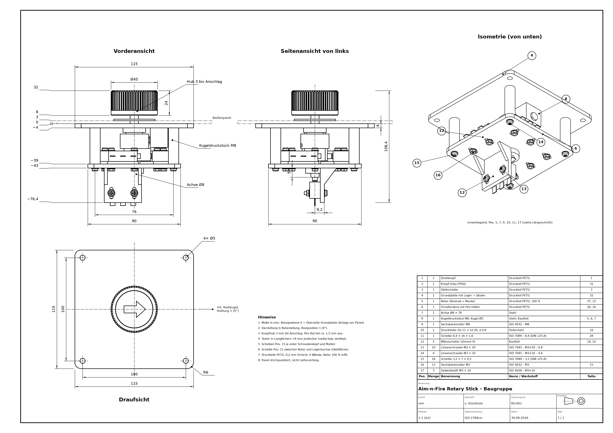
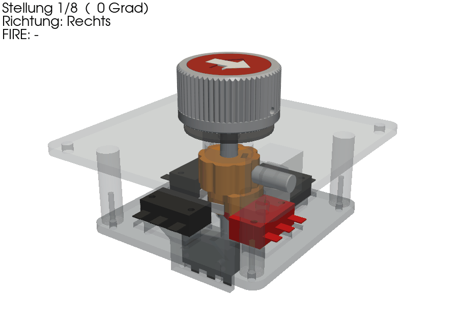
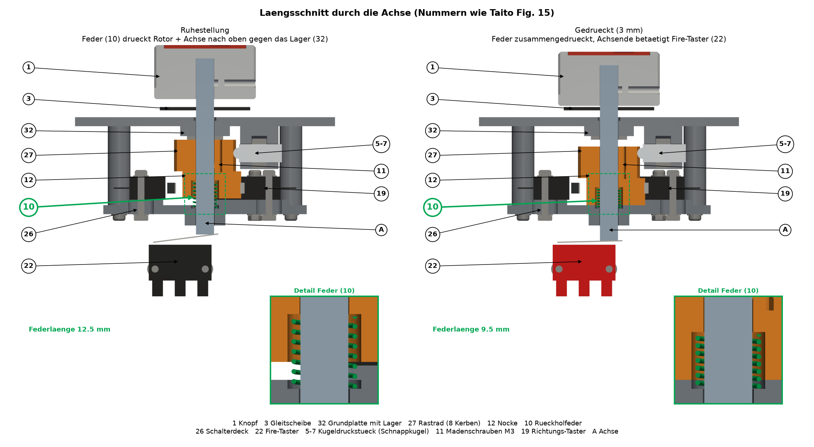

# Taito Rotary Stick – druckbarer Nachbau

Nachbau des Taito „Aim-n-Fire“-Rotary-Sticks (Front Line, Wild Western, The Tin Star):
8 Rastpositionen, 4 Richtungs-Microtaster (8-Wege-Logik wie ein Joystick) und ein Fire-Taster,
der durch Herunterdrücken des Knopfs auslöst. Aufbau nach der Explosionszeichnung
„Revolving Control Assembly (WWK00003)“, Fig. 15. Parametrisch in [build123d](https://github.com/gumyr/build123d).



| Animation | Längsschnitt |
|---|---|
|  |  |

## Inhalt

| Pfad | Inhalt |
|---|---|
| `models/rotary_stick.py` | Parametrisches Modell mit Plausibilitätsprüfungen (Schaltlogik, Kollisionen, Hub), exportiert STL/STEP |
| `scripts/drawing_rotary.py` | Bemaßte Baugruppenzeichnung A2 mit Stückliste (PDF/PNG) |
| `scripts/section_rotary.py` | Längsschnitt Ruhe/gedrückt mit Rückholfeder |
| `scripts/animate_rotary.py` | Animation Drehen/Drücken mit Tasterreaktion (GIF) |
| `scripts/render_rotary.py` | Vorschaubilder (Baugruppe, Explosion, Schaltlogik) |
| `exports/rotary_stick/` | Druckfertige STL (in Druckorientierung), STEP, Zeichnung, Bilder, [Bauanleitung](exports/rotary_stick/BAUANLEITUNG.md) |

## Funktion

- **8 Klicks:** Kugeldruckstück rastet radial in 8 senkrechte Kerben des Rastrads. Die Kerben laufen axial,
  daher stört der Fire-Hub die Rastung nicht.
- **8 Richtungen mit 4 Tastern:** Nocke mit ~96° Nockenbreite drückt in den Hauptrichtungen einen, in den
  Diagonalen zwei benachbarte Taster. Schaltfenster ≈ 3,7 mm, Taster in Langlöchern justierbar.
- **Fire:** Knopf 3 mm bis Anschlag drücken, das Achsende betätigt den unteren Taster; die Druckfeder im Rotor
  stellt zurück. Die Nocke überdeckt die Taster-Hebel über den ganzen Hub (wird im Skript geprüft).

## Neu erzeugen

```bash
python -m venv .venv
.venv/Scripts/pip install -r requirements.txt   # Linux/macOS: .venv/bin/pip
.venv/Scripts/python models/rotary_stick.py      # STL/STEP + Prüfungen
.venv/Scripts/python scripts/drawing_rotary.py   # Zeichnung
```

Maße der Kaufteile (Achse, Kugeldruckstück, Taster) stehen als Parameter oben in `models/rotary_stick.py`
und sollten vor dem Druck nachgemessen werden.
